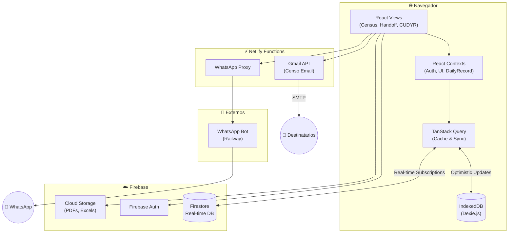
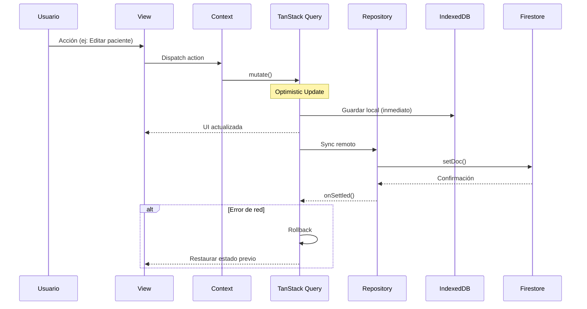
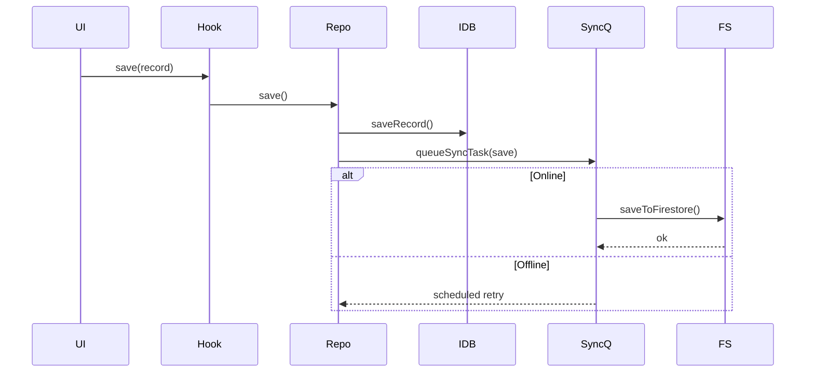
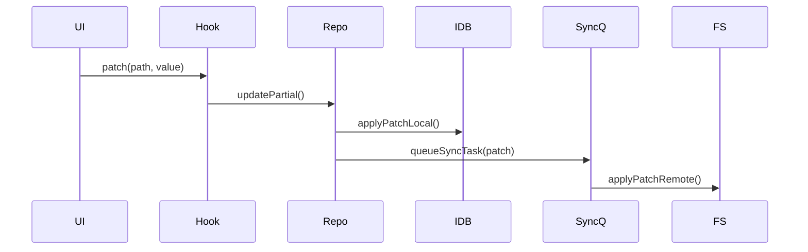
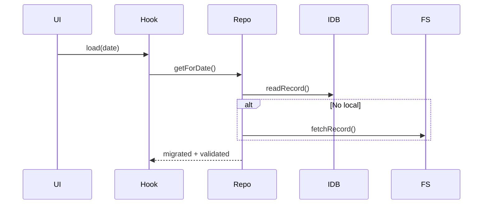

# Arquitectura del Sistema HHR

Sistema de gestión de censo diario de pacientes hospitalizados para el Hospital Hanga Roa.

---

## 🏗️ Diagrama de Alto Nivel



---

## ✅ Enfoque de Estabilidad

- **Offline-first:** IndexedDB como almacenamiento primario y Firestore como sync remoto.
- **Integridad clínica:** validación estricta con Zod + guardas de regresión.
- **Concurrencia segura:** control optimista y updates parciales por celda (LWW).
- **Recuperación:** auto-repair de IndexedDB y fallback controlado.
- **Auth por entorno:** popup como flujo principal, acceso directo solo cuando la configuración Firebase lo soporta y advertencias de arranque cuando faltan variables críticas.
- **Observabilidad local:** métricas y logs guardados localmente para diagnóstico offline.
- **Cola de sync:** cambios encolados con deduplicación y backoff.

Para más detalle de flujos y decisiones, ver `docs/architecture.md`.
Para resumen ejecutivo y stack, ver este documento.
La taxonomía canónica del repo vive en `docs/CODEBASE_CANON.md`.

## Guardrails de calidad

- La guía transversal de calidad está en `docs/QUALITY_GUARDRAILS.md`.
- El checklist mínimo de cambios seguros está en `docs/SAFE_CHANGE_CHECKLIST.md`.
- Los entrypoints operativos de CI/reporting de Fase 4 son:
  - `npm run ci:quality-core`
  - `npm run check:quality`
  - `npm run report:quality-metrics`
  - `npm run report:operational-health`
  - `npm run report:runtime-contracts`

---

## 📦 Stack Tecnológico

| Capa                 | Tecnología                        | Versión         |
| -------------------- | --------------------------------- | --------------- |
| **UI**               | React                             | 19.2.1          |
| **Language**         | TypeScript                        | 5.8.2           |
| **Build**            | Vite                              | 6.2.0           |
| **State Management** | TanStack Query                    | 5.90.12         |
| **Styling**          | CSS Modules + utilidades Tailwind | -               |
| **Database**         | Firestore                         | 12.6.0          |
| **Local Storage**    | IndexedDB (Dexie.js)              | 4.2.1           |
| **Auth**             | Firebase Auth                     | 12.6.0          |
| **Validation**       | Zod                               | 3.25.76         |
| **Testing**          | Vitest + Playwright               | 4.0.15 / 1.57.0 |
| **Hosting**          | Netlify                           | -               |

---

## 🗂️ Estructura de Directorios (src/)

```
src/
├── components/                 # Componentes UI (Layout, Census, Shared)
├── features/                   # Módulos por funcionalidad
│   ├── admin/                  # Auditoría, Configuración, Salud del Sistema
│   ├── analytics/              # Estadísticas MINSAL, gráficos
│   ├── census/                 # Gestión de camas y pacientes
│   ├── cudyr/                  # Scoring de dependencia y categorización
│   ├── handoff/                # Entrega de Turno (Enfermería/Médica)
│   ├── whatsapp/               # Integración con bot de notificaciones
│   └── errors/                 # Monitoreo de errores en runtime
│
├── core/                       # Núcleo técnico
│   ├── ui/                     # Sistema de Diseño (@core/ui) - Botones, Modales, Inputs
│   └── auth/                   # Lógica de Autenticación
│
├── domain/                     # Lógica de Negocio Pura (Agnóstica de Framework)
│   └── CensusManager.ts        # Reglas de movimiento, alta y egreso
│
├── services/                   # Infraestructura y Persistencia
│   ├── repositories/           # Patrón Repository para Firestore/IDB
│   ├── storage/                # Implementación de persistencia física
│   ├── backup/                 # Gestión de respaldos en la nube
│   └── pdf/                    # Generación dinámica de documentos
│
├── context/                    # Estado Global (Shared Contexts)
├── hooks/                      # Hooks transversales y composición React
├── application/                # Casos de uso, outcomes homogéneos y puertos
├── infrastructure/             # Placeholder retirado (no agregar código nuevo)
├── schemas/                    # Validación Zod (Seguridad en runtime)
├── types/                      # Definiciones de tipos del dominio
├── utils/                      # Helpers y utilidades técnicas
└── tests/                      # Suite de tests automatizados (>1350)
```

---

## 🔄 Flujo de Datos



---

## ⚡ Flujos Críticos (Resumen)

### Guardado completo (online/offline)



### Patch parcial (LWW)



### Lectura (con migración suave)



---

## 🧩 Contratos de Datos (Resumen)

- **DailyRecord:** `date` ISO, `beds` fijo por catálogo, `activeExtraBeds` coherente, `patients` con `id` único.
- **Patch parcial:** `path` en dot-notation, `value` serializable, `lastUpdated` para LWW.
- **SyncTask:** `type`, `key`, `status`, `attempts`, `nextAttemptAt`.

---

## 🧭 Cómo leer esta arquitectura (para novatos)

1. **Empieza por el flujo de datos**: mira “Flujo de Datos” y “Flujos Críticos” para entender qué pasa cuando el usuario guarda o edita.
2. **Ubica la capa donde ocurre cada cosa**: UI/Views dispara acciones, Hooks coordinan, Repositories persisten, Storage escribe/lee.
3. **Aprende los contratos de datos**: estos “acuerdos” evitan errores al mover datos entre capas.
4. **Revisa estabilidad y seguridad**: mira “Enfoque de Estabilidad” y “Seguridad” para entender por qué el sistema no se cae y protege datos.
5. **Si algo falla**: busca en “Observabilidad” y “Flujos Críticos” para ubicar el punto de diagnóstico.

---

## 🔌 Boundary Actual (Use Cases + Ports)

- `src/application/*` coordina side-effects críticos y devuelve `ApplicationOutcome`.
- `src/application/ports/*` es el único lugar donde los use-cases pueden atarse por defecto a servicios concretos.
- `RepositoryProvider` es obligatorio; los consumers no deben depender de fallbacks implícitos.
- `services/infrastructure/*` recibe dependencias por factory/constructor cuando actúa como provider reutilizable.
- `src/hooks/*`, `src/components/*` y `src/features/*` no deben importar directo:
  - `auditService`
  - `DailyRecordRepository`
  - `ClinicalDocumentRepository`
  - `censusEmailService`
- Si una operación ya existe en `application/`, la UI debe consumir el use-case o un hook fachada, no el servicio remoto.
- Este boundary se verifica automáticamente con `npm run check:application-port-boundary`.

---

## ✅ Checklist de Consistencia (ARCHITECTURE vs docs/architecture)

## Línea Base de Calidad

Snapshot regenerado el `2026-02-28`:

- Archivos fuente: `979`
- Líneas fuente: `95398`
- Módulos sobredimensionados: `0`
- Violaciones de deuda entre carpetas: `0`
- Explicit `any` en source: `0`

## Notas de Operación

- El acceso alternativo de Google no se ofrece automáticamente en `localhost` salvo habilitación explícita.
- Cuando IndexedDB falla por bloqueo o backing store, la app intenta una auto-recuperación inicial y solo luego expone UI de aviso.
- Archivos de test: `474`
- Flake-risk test files: `0`

Fuente de verdad:

- [reports/quality-metrics.md](reports/quality-metrics.md)

## Próximo Hotspot Recomendado

Motivo:

- el siguiente foco real está en servicios grandes y cohesionados parcialmente, no en módulos demo ya retirados.
- los candidatos con mejor retorno actual son integraciones y autenticación, donde sigue habiendo mezcla de responsabilidades y superficie operativa alta.

- **Principios**: offline-first, integridad clínica, concurrencia, recuperación.
- **Capas**: UI → Contexts/Hooks → Repos → Storage.
- **Flujos críticos**: save completo, patch parcial, lectura con migración suave.
- **Contratos**: DailyRecord, Patch, SyncTask alineados.
- **Observabilidad**: logs/health/pending sync reflejados en ambos documentos.
- **Stack**: versiones en `ARCHITECTURE.md` coinciden con `package.json`.

---

## 🧱 Patrones de Diseño

### 1. Repository Pattern

Abstrae la complejidad de elegir entre almacenamiento local (IDB) o remoto (Firestore).

```typescript
import { DailyRecordRepository } from '@/services/repositories/DailyRecordRepository';
const record = await DailyRecordRepository.getForDate('2026-01-08');
```

### 2. Export & Backup Manager

Manejador centralizado para la generación de documentos y su respaldo automático en la nube.

```typescript
const { handleBackupHandoff } = useExportManager();
// Gatilla PDF local + Backup Cloud automáticamente
```

### 3. TanStack Query Hooks

Gestiona el ciclo de vida de los datos, revalidación y estados de carga.

```typescript
const { data } = useDailyRecordQuery(dateString);
const mutation = useSaveDailyRecordMutation();
```

### 4. Interoperabilidad (HL7 FHIR)

Utiliza transformadores para convertir datos del dominio HHR a recursos estándar FHIR R4 (Core-CL).

```typescript
import { mapPatientToFhir } from '@/services/utils/fhirMappers';
const fhirPatient = mapPatientToFhir(localPatient);
```

---

## 🔐 Seguridad

- **RBAC:** Control de acceso en `utils/permissions.ts`.
- **Validation:** Validación estricta con Zod antes de persistir cualquier dato.
- **Auditoría:** Registro inmutable de cada cambio crítico en el sistema.

---

_Última actualización: 08 de Febrero 2026_
