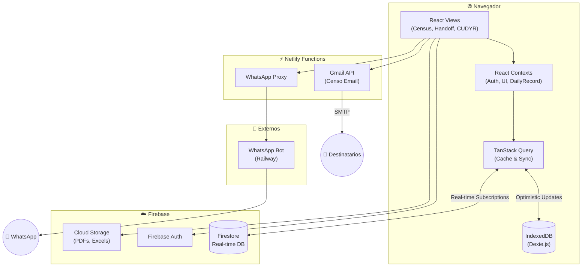
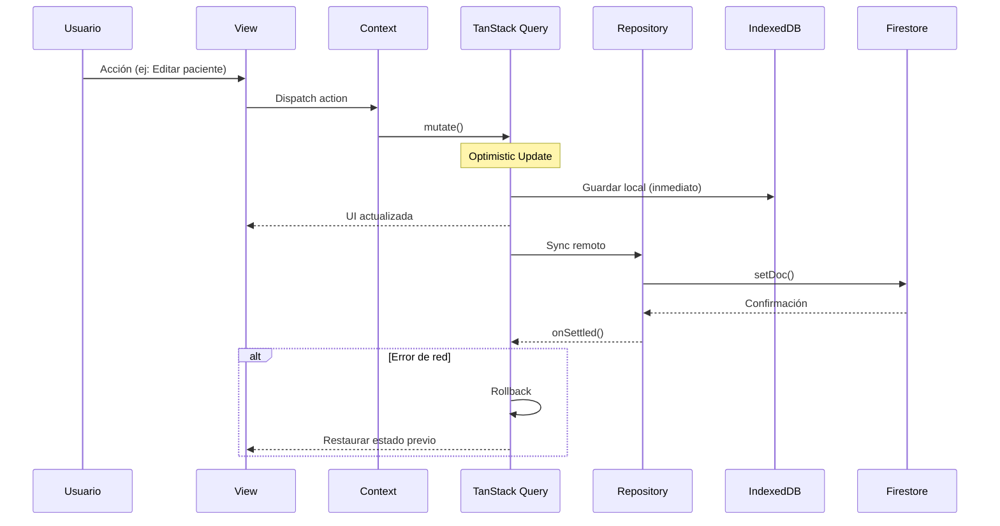

# Arquitectura del Sistema HHR

Sistema de gestión de censo diario de pacientes hospitalizados para el Hospital Hanga Roa.

---

## 🏗️ Diagrama de Alto Nivel



---

## 📦 Stack Tecnológico

| Capa | Tecnología | Versión |
|------|------------|---------|
| **UI** | React | 19.2 |
| **Language** | TypeScript | 5.8 |
| **Build** | Vite | 6.4 |
| **State Management** | TanStack Query | 5.x |
| **Styling** | Vanilla CSS | - |
| **Database** | Firestore | - |
| **Local Storage** | IndexedDB (Dexie.js) | 4.x |
| **Auth** | Firebase Auth | - |
| **Validation** | Zod | 3.25 |
| **Testing** | Vitest 4.0 + Playwright | - |
| **Hosting** | Netlify | - |

---

## 🗂️ Estructura de Directorios (src/)

```
src/
├── components/                 # Componentes UI (Layout, Census, Shared)
├── features/                   # Módulos por funcionalidad
│   ├── admin/                  # Auditoría, Configuración, Salud del Sistema
│   ├── analytics/              # Estadísticas MINSAL, gráficos
│   ├── census/                 # Gestión de camas y pacientes
│   ├── cudyr/                  # Scoring de dependencia y categorización
│   ├── handoff/                # Entrega de Turno (Enfermería/Médica)
│   ├── whatsapp/               # Integración con bot de notificaciones
│   └── errors/                 # Monitoreo de errores en runtime
│
├── core/                       # Núcleo técnico (Auth, Firebase Config)
├── services/                   # Lógica de negocio y persistencia
│   ├── repositories/           # Patrón Repository para Firestore/IDB
│   ├── storage/                # Implementación de persistencia física
│   ├── backup/                 # Gestión de respaldos en la nube
│   └── pdf/                    # Generación dinámica de documentos
│
├── context/                    # Estado Global (Shared Contexts)
├── hooks/                      # Hooks transversales (Query, UI, Validation)
├── schemas/                    # Validación Zod (Seguridad en runtime)
├── types/                      # Definiciones de tipos del dominio
├── utils/                      # Helpers y utilidades técnicas
└── tests/                      # Suite de tests automatizados (>1350)
```

---

## 🔄 Flujo de Datos



---

## 🧱 Patrones de Diseño

### 1. Repository Pattern
Abstrae la complejidad de elegir entre almacenamiento local (IDB) o remoto (Firestore).
```typescript
import { DailyRecordRepository } from '@/services/repositories/DailyRecordRepository';
const record = await DailyRecordRepository.getForDate('2026-01-08');
```

### 2. Export & Backup Manager
Manejador centralizado para la generación de documentos y su respaldo automático en la nube.
```typescript
const { handleBackupHandoff } = useExportManager();
// Gatilla PDF local + Backup Cloud automáticamente
```

### 3. TanStack Query Hooks
Gestiona el ciclo de vida de los datos, revalidación y estados de carga.
```typescript
const { data } = useDailyRecordQuery(dateString);
const mutation = useSaveDailyRecordMutation();
```

### 4. Interoperabilidad (HL7 FHIR)
Utiliza transformadores para convertir datos del dominio HHR a recursos estándar FHIR R4 (Core-CL).
```typescript
import { mapPatientToFhir } from '@/services/utils/fhirMappers';
const fhirPatient = mapPatientToFhir(localPatient);
```

---

## 🔐 Seguridad

- **RBAC:** Control de acceso en `utils/permissions.ts`.
- **Validation:** Validación estricta con Zod antes de persistir cualquier dato.
- **Auditoría:** Registro inmutable de cada cambio crítico en el sistema.

---

*Última actualización: 25 de Enero 2026*
