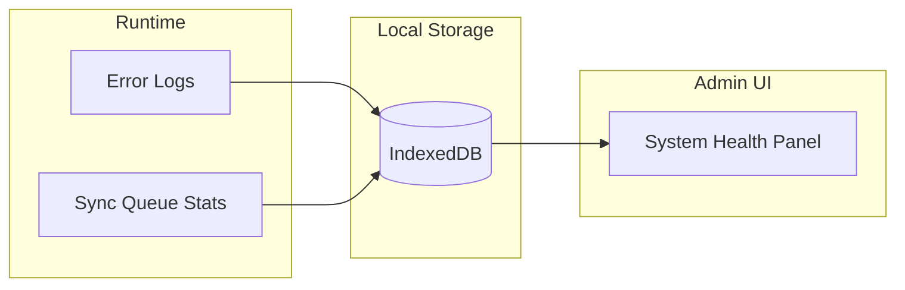
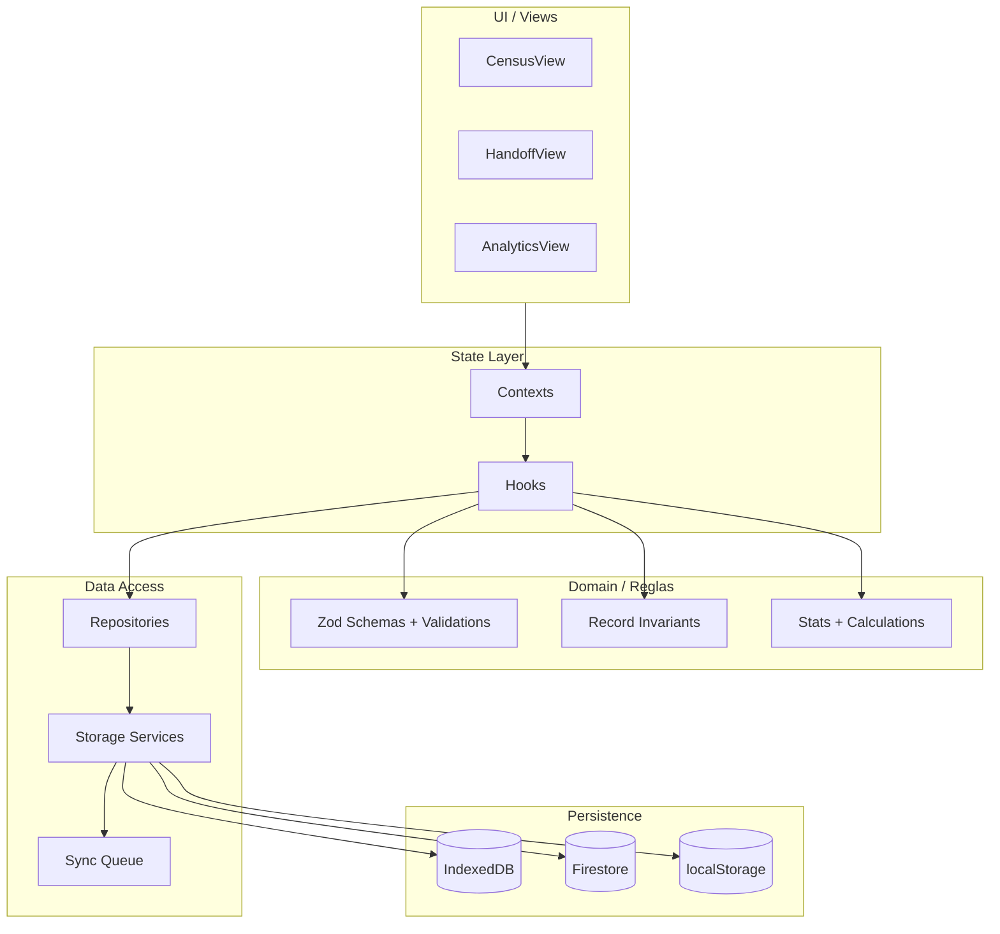
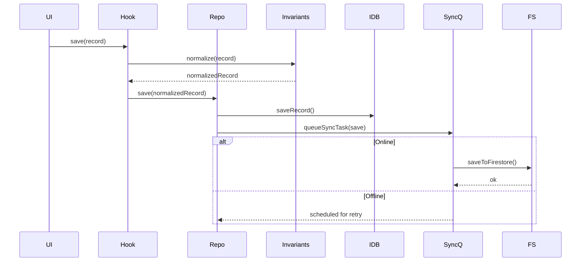
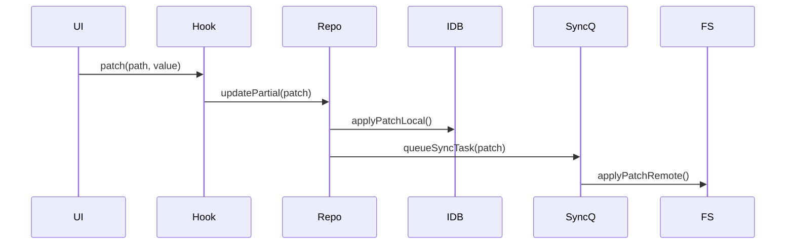
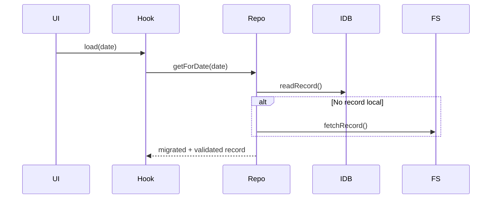
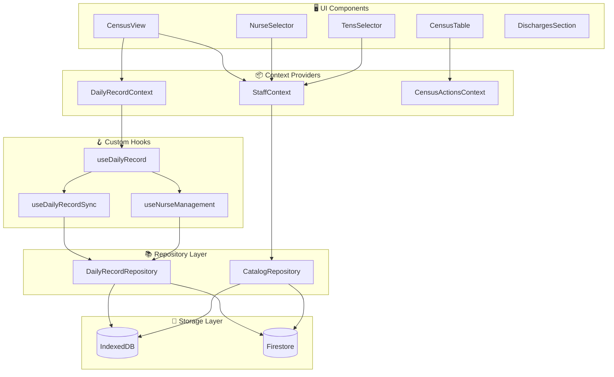
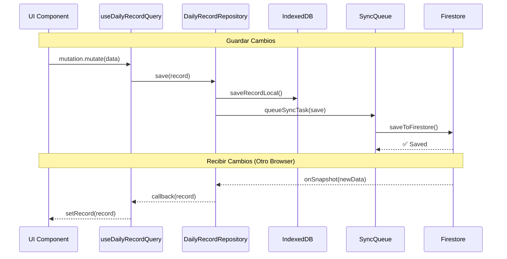
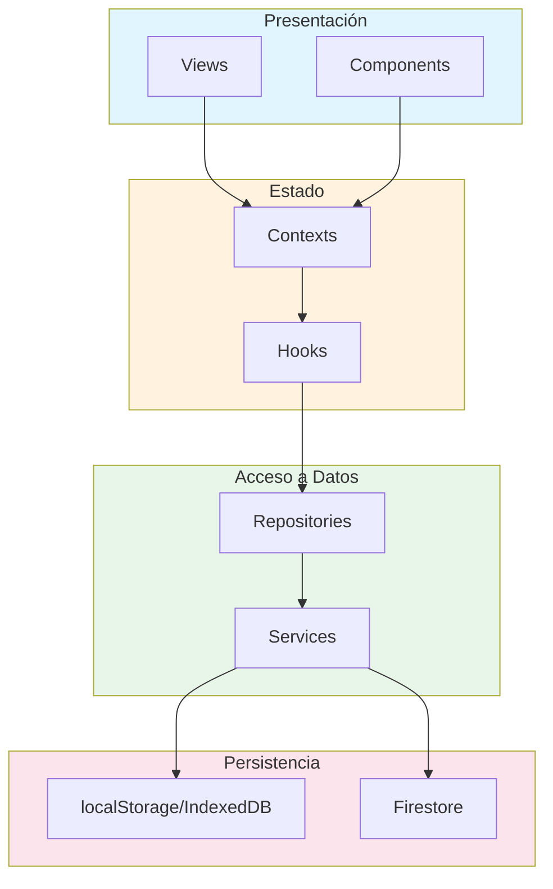
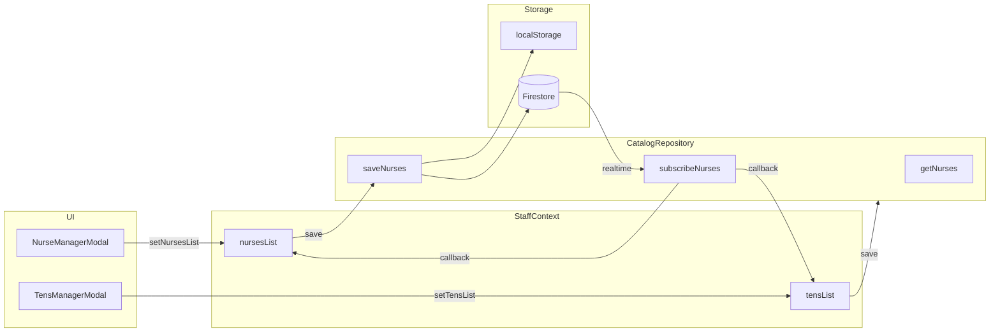
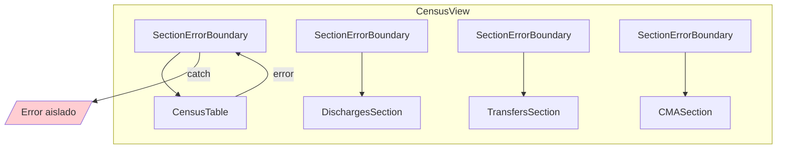

# Arquitectura del Sistema - Diagrama de Flujo de Datos

Resumen ejecutivo: ver `ARCHITECTURE.md`.

## Stack Tecnologico (resumen)

| Capa | Tecnologia | Version |
|------|------------|---------|
| **UI** | React | 19.2.1 |
| **Language** | TypeScript | 5.8.2 |
| **Build** | Vite | 6.2.0 |
| **State Management** | TanStack Query | 5.90.12 |
| **Local Storage** | IndexedDB (Dexie.js) | 4.2.1 |
| **Validation** | Zod | 3.25.76 |

## Principios y Objetivos

- **Offline-first**: la aplicación debe funcionar sin red; IndexedDB es el almacenamiento primario local.
- **Integridad clínica**: validación estricta con Zod antes de persistir y guardas contra regresión masiva.
- **Sincronización segura**: actualizaciones parciales con LWW por celda y control de concurrencia optimista.
- **Recuperación automática**: tolerancia a fallas de IndexedDB y Firestore con degradación controlada.
- **Observabilidad local**: métricas y logs almacenados localmente para diagnóstico sin internet.

## Modelo de Consistencia y Concurrencia

- **Fuente primaria local**: la UI lee/escribe primero en IndexedDB.
- **Sincronización remota**: Firestore se actualiza en segundo plano.
- **Concurrencia optimista**: en guardado completo se usa `expectedLastUpdated` para evitar pisar cambios remotos recientes.
- **LWW por celda**: los updates parciales se aplanan a dot-notation y se aplican de forma granular.
- **Cola de sincronización**: cambios locales se encolan con backoff y deduplicación para evitar sobrecarga.

## Modos de Falla y Recuperación

- **Firestore offline**: la app continúa en modo local; se reintenta la sincronización al recuperar red.
- **IndexedDB corrupto/bloqueado**: se intenta auto-recuperación y, si falla, se cae a modo memoria (con pérdida al recargar).
- **Datos heredados**: al leer se ejecuta migración suave + defaults; al guardar, validación estricta.
- **Storage inconsistente**: lecturas de localStorage se validan/parsean con fallback para evitar crashes por JSON corrupto.

## Versionado y Migraciones

- **Schema versioning**: cada registro incluye `schemaVersion`.
- **Migración de legacy**: se aplican ajustes de compatibilidad antes de usar un registro antiguo.
- **Bloqueo por versión**: si el remoto usa una versión mayor, se aborta el guardado local.

## Observabilidad

- **Logs de error**: guardados localmente para diagnóstico offline.
- **Auditoría**: cambios críticos se registran de forma inmutable y con trazabilidad por usuario.
- **Salud del sistema**: métricas de pendientes (incluye cola de sync) expuestas al panel admin.

Ejemplos:
- Log de error: `{ level: "error", scope: "storage", message: "IndexedDB blocked", at: "2026-01-31T10:12:03Z" }`
- Metrica de salud: `{ pendingMutations: 3, pendingSyncTasks: 2, lastSyncAt: "2026-01-31T10:15:00Z" }`

## Como leer esta arquitectura (para novatos)

1) Empieza por "Flujos Criticos" para entender que pasa cuando se guarda o edita.
2) Ubica la capa donde ocurre cada cosa (UI, Hooks, Repos, Storage).
3) Aprende los contratos de datos para evitar errores al mover datos.
4) Revisa "Principios y Objetivos" para estabilidad y seguridad.
5) Si algo falla, revisa "Observabilidad" para diagnostico.

---

## Mapa de Módulos (Nivel Alto)

---

## Flujos Críticos

### Guardado completo de DailyRecord (online/offline)

### Update parcial (LWW por celda)

### Lectura de record (con migración suave)

## Flujo General de Datos

---

## Flujo de Sincronización en Tiempo Real

---

## Estructura de Capas

---

## Interfaces entre Capas (Reglas de Dependencia)

- **UI/Views**: solo usa Hooks y Contexts (sin acceso directo a storage).
- **Hooks**: coordinan lógica y llaman Repos/Services, no a IndexedDB/Firestore directo.
- **Repositorios**: encapsulan persistencia y reglas de dominio (invariantes + validación).
- **Storage Services**: únicos responsables de IndexedDB/Firestore/localStorage.
- **Infraestructura DB**: acceso abstracto a base de datos (FirestoreProvider).

---

## Flujo de Catálogos (Enfermeras/TENS)

---

## Error Boundaries

---

## Archivos Clave por Capa

| Capa | Archivos |
|------|----------|
| **Views** | `CensusView.tsx`, `AnalyticsView.tsx`, `HandoffView.tsx` |
| **Contexts** | `DailyRecordContext.tsx`, `StaffContext.tsx`, `AuthContext.tsx` |
| **Hooks** | `useDailyRecord.ts`, `useMinsalStats.ts`, `useHandoffLogic.ts` |
| **Repositories** | `DailyRecordRepository.ts`, `PatientHistoryRepository.ts` |
| **Services** | `firestoreService.ts`, `indexedDBService.ts`, `pdfStorageService.ts` |
| **Storage** | IndexedDB (Dexie), Firestore, Cloud Storage |

---

## Contratos de Datos (Resumen)

### DailyRecord (resumen)

- `date`: ISO `YYYY-MM-DD` (único por día).
- `beds`: mapa fijo de camas definidas en catálogo.
- `activeExtraBeds`: subconjunto de beds válidas.
- `patients`: lista de pacientes con `id` único y campos validados.
- `lastUpdated`/`schemaVersion`: metadatos para control de concurrencia y migraciones.

### Patch de actualización parcial

- `path`: dot-notation sobre DailyRecord (ej: `beds.C1.patient.name`).
- `value`: valor serializable.
- `lastUpdated`: timestamp local para LWW por celda.

### SyncTask (cola de sync)

- `type`: `save` | `patch` | `delete`.
- `key`: clave lógica (ej: `dailyRecord:2025-01-01`).
- `status`: `pending` | `processing` | `failed`.
- `attempts`/`nextAttemptAt`: control de reintentos con backoff.

---

## Checklist de Consistencia (con ARCHITECTURE.md)

- Principios: offline-first, integridad clinica, concurrencia, recuperacion.
- Capas: UI -> Contexts/Hooks -> Repos -> Storage.
- Flujos criticos: save completo, patch parcial, lectura con migracion suave.
- Contratos: DailyRecord, Patch, SyncTask.
- Observabilidad: logs/health/pending sync.
- Stack: versiones en `ARCHITECTURE.md` coinciden con `package.json`.
